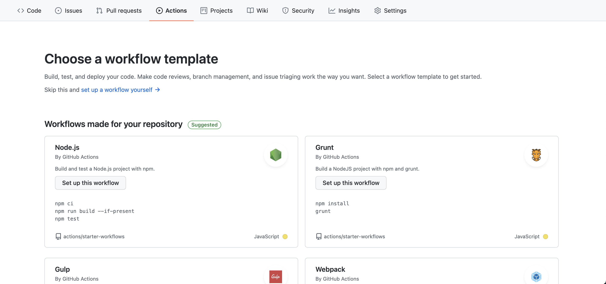
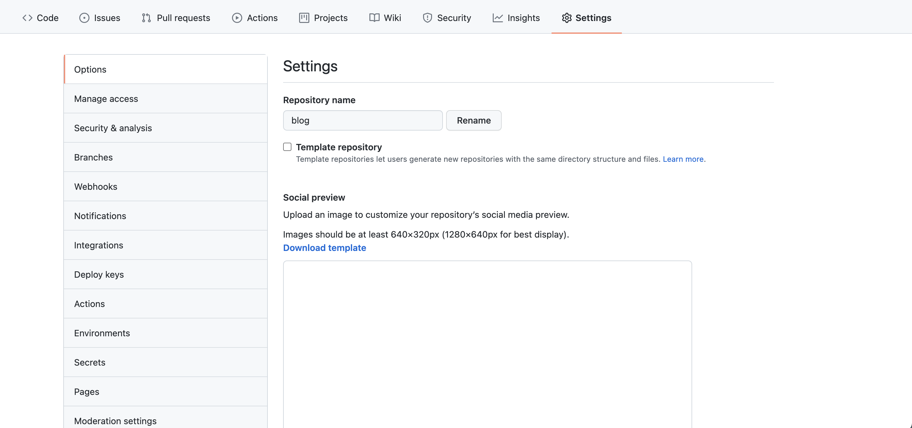
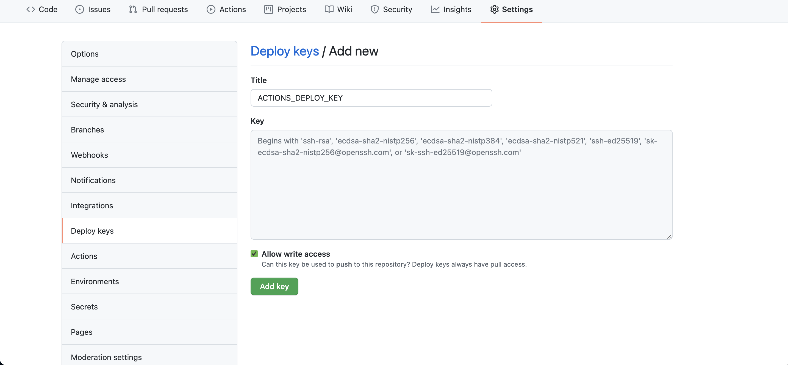
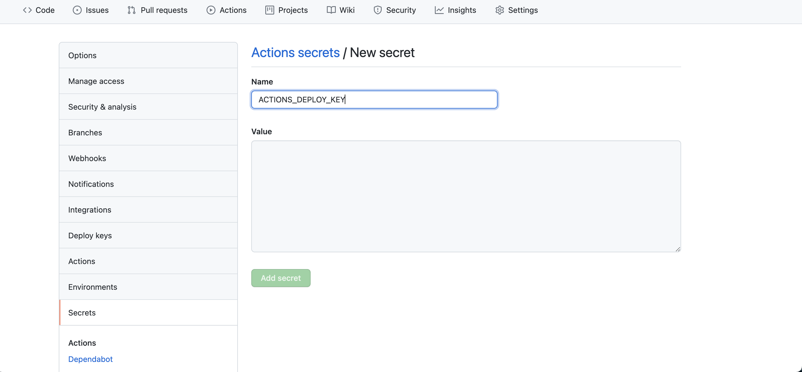
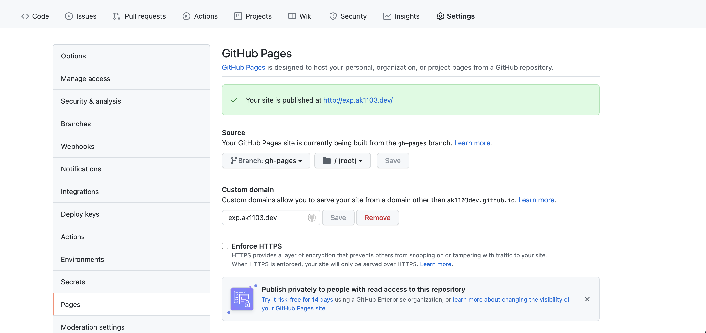

[บทความที่แล้ว](https://ak1103dev.com/%E0%B8%AA%E0%B8%A3%E0%B9%89%E0%B8%B2%E0%B8%87%20Blog%20%E0%B8%87%E0%B9%88%E0%B8%B2%E0%B8%A2%E0%B9%86%20%E0%B8%94%E0%B9%89%E0%B8%A7%E0%B8%A2%20Gatsby/) ผมสร้าง blog ด้วย Gatsyby ไว้แล้วนะครับ

สิ่งที่ผมจะทำต่อ คือ ทำ automate deployment โดยใช้ GitHub Actions เป็น CI (Continuous Intregation) ฟรีของ GitHub

วิธีก็คือ เราจะสร้าง ไฟล์เอง หรือ จะเลือก template ใน tab Actions ใน repository ของ project ก็ได้



---

## Set GitHub Actions

เดี๋ยว ผมพาทำแบบสร้างไฟล์เองละกัน

1. เริ่มจาก สร้าง directory `.github/workflows` ใน project แล้วสร้าง file `main.yml` (หรือ ชื่ออื่นก็ได้) ใน directory `.github/workflows`

จากนั้นเดี๋ยวผมจะค่อยเพิ่มทีละส่วน

2. ส่วนแรกคือ ตั้งชื่อ workflow ก่อน

```yml
# .github/workflows/main.yml

name: Node.js CI
```

3. จากนั้น ก็เพิ่มส่วนที่จะให้ทำงานเมื่อไร โดยผมจะให้มันทำงานเมื่อ push code ไป branch main หรือ pull request ไป branch main

```yml
# .github/workflows/main.yml

name: Node.js CI

on:
  push:
    branches: [main]
  pull_request:
    branches: [main]
```

4. ส่วนต่อมา จะกำหนด jobs ในที่นี้ ผมใส่ job เดียว ตั้งชื่อว่า build
   รันบน ubuntu เวอร์ชั่นล่าสุด

```yml
# .github/workflows/main.yml

name: Node.js CI

on:
  push:
    branches: [main]
  pull_request:
    branches: [main]

jobs:
  build:
    runs-on: ubuntu-latest
```

5. กำหนด node-version เป็น 16.x

```yml
# .github/workflows/main.yml

name: Node.js CI

on:
  push:
    branches: [main]
  pull_request:
    branches: [main]

jobs:
  build:
    runs-on: ubuntu-latest

    strategy:
      matrix:
        node-version: [16.x]
        # See supported Node.js release schedule at https://nodejs.org/en/about/releases/
```

6. กำหนด steps การทำงาน ก็คือ

- setup node version
- install package
- build app (ที่เห็นเป็นคำสั่งของ gatsby นะ ถ้าเป็น framework อื่นก็จะเป็นคำสั่งอื่น)
- deploy to github pages

```yml
# .github/workflows/main.yml

name: Node.js CI

on:
  push:
    branches: [main]
  pull_request:
    branches: [main]

jobs:
  build:
    runs-on: ubuntu-latest

    strategy:
      matrix:
        node-version: [16.x]
        # See supported Node.js release schedule at https://nodejs.org/en/about/releases/

    steps:
      - uses: actions/checkout@v2

      - name: Use Node.js ${{ matrix.node-version }}
        uses: actions/setup-node@v2
        with:
          node-version: ${{ matrix.node-version }}
          cache: "npm"

      - name: Install Packages
        run: yarn

      - name: Build app
        run: ./node_modules/.bin/gatsby build --prefix-paths

      - name: Deploy to gh-pages
        uses: peaceiris/actions-gh-pages@v3
        with:
          deploy_key: ${{ secrets.ACTIONS_DEPLOY_KEY }}
          publish_dir: ./public
```

พอสร้างไฟล์นี้เสร็จแล้ว ก็ push code ขึ้น branch main มันก็จะรันตาม steps ที่เราวางไว้

แต่น่าจะรันไม่ผ่าน เพราะที่ step deploy to github pages เรายังไม่ได้กำหนด secrets.ACTIONS_DEPLOY_KEY เลย

---

## Set SSH Private Key deploy_key

1. generate SHH key ตาม link นี้ https://docs.github.com/en/authentication/connecting-to-github-with-ssh/generating-a-new-ssh-key-and-adding-it-to-the-ssh-agent
   เราจะได้ 2 ไฟล์ คือ public key (ไฟล์ .pub) กับ private key (ไฟล์ที่ไม่มีสกุล)
2. ไปที่ setting ของ repository

   

3. ไปที่เมนู Deploy keys เราจะ add deploy key ด้วย public key และเลือก Allow write access ไว้ด้วย

   

4. ไปที่เมนู Secrets เราจะ New repository secret โดยใส่ private key

   

เป็นอันเรียบร้อย ไปกดให้ GitHub Actions รันอีกรอบหนึ่งน่าจะสำเร็จแล้ว

เราก็มาดู link github pages ได้ใน Settings -> Pages



> อะไรทำให้ Auto ได้ ทำเถอะ ชีวิตจะได้สบายขึ้น

---

## References

- https://github.com/marketplace/actions/checkout
- https://github.com/marketplace/actions/setup-node-js-environment
- https://github.com/marketplace/actions/github-pages-action
